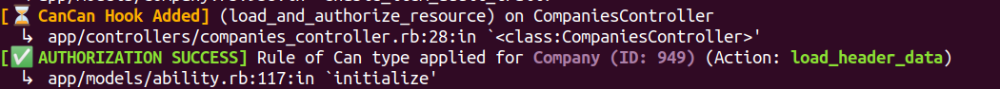

# Verbose CanCanCan 

## Description
This is a verbose [extension](https://rubygems.org/gems/verbose_cancancan) for [CanCanCan](https://github.com/CanCanCommunity/cancancan) that prints the location of matching rule definitions and authorization hooks on terminal. It helps developers debug and understand where authorization rules are being applied within their application.

**Note:** This gem is an extension and requires CanCanCan to be installed in your Rails App.

## Features
- Displays the location where the selected rule for authorization was defined.
- Prints the locations where `load_and_authorize_resource` and `authorize!` hooks are defined.

## Screenshot


## Installation
Add this line to your application's Gemfile:

```ruby
group :development do
  gem "verbose_cancancan"
end
```

And then execute
```bash
bundle install
```

## Usage

Once installed, the extension will automatically enhance CanCanCan’s logging to display rule and hook locations when performing authorization checks.

## Contributing

Bug reports and pull requests are welcome.

## License

This project is available as open-source under the terms of the MIT License.

## Note
Please use this gem in development only.
